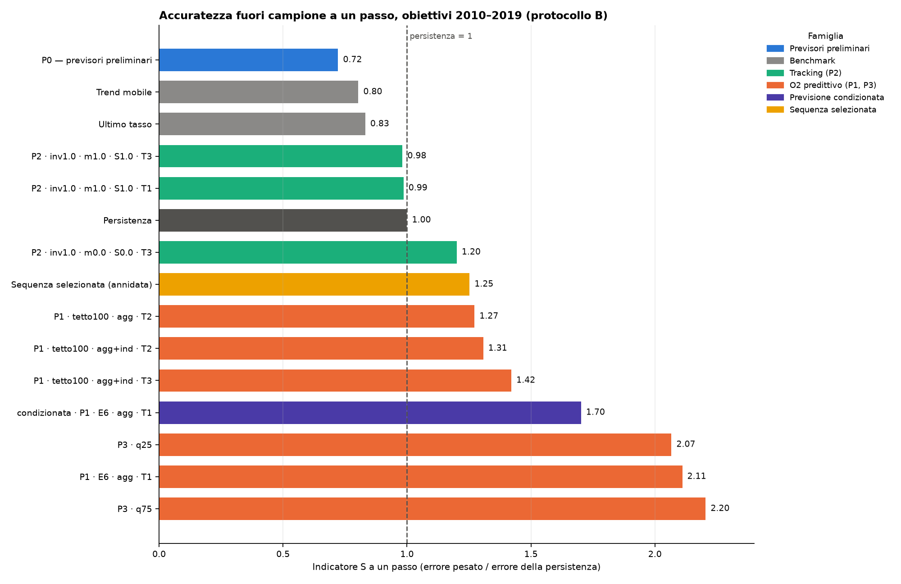
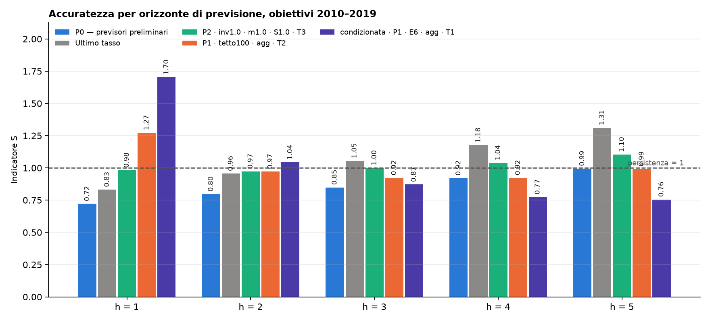
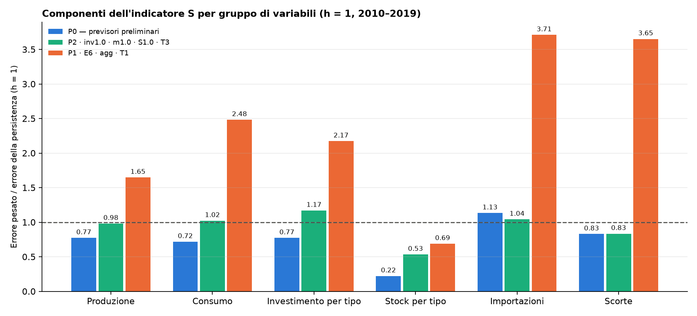
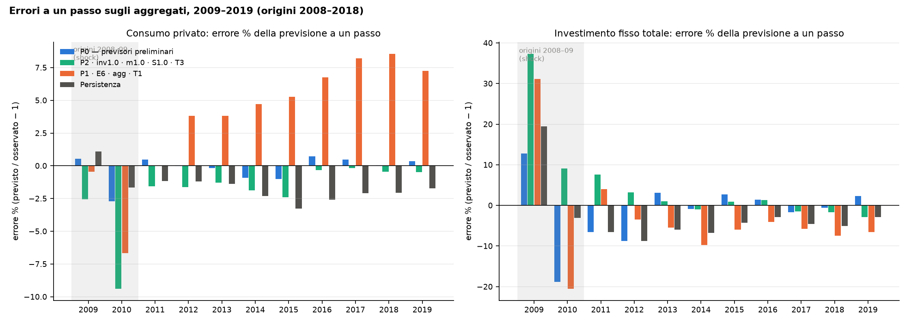
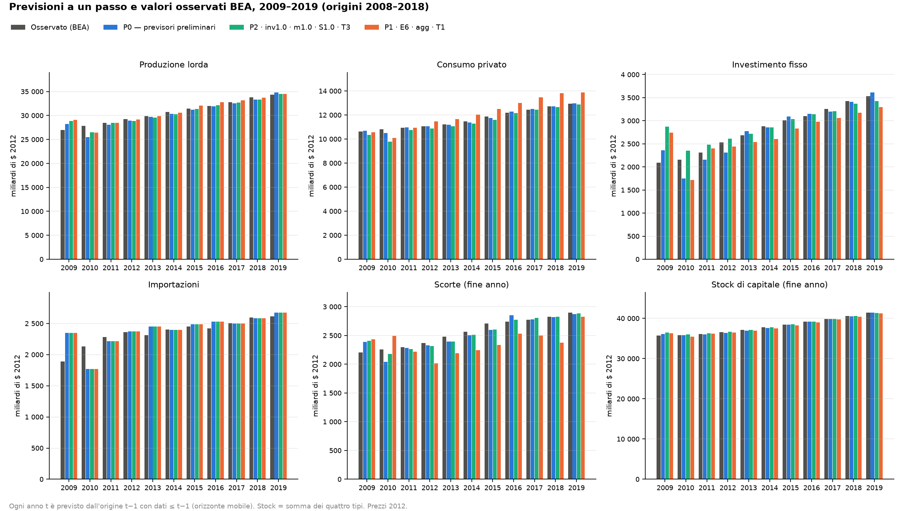
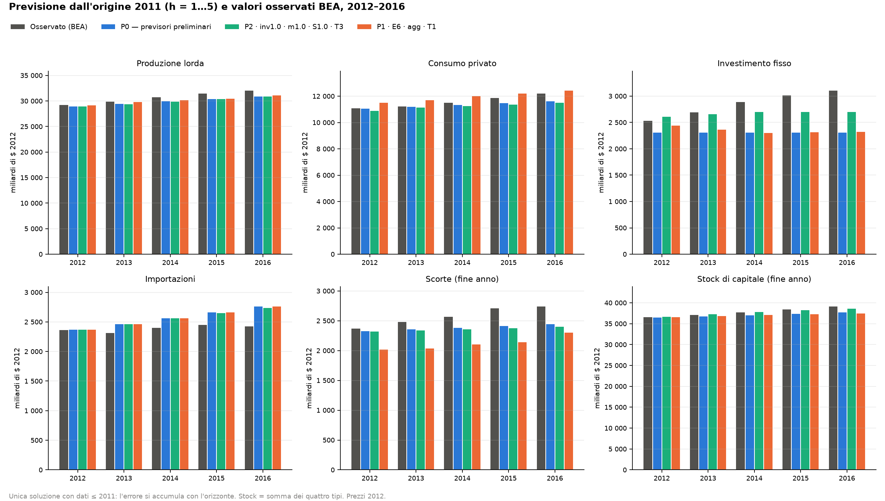
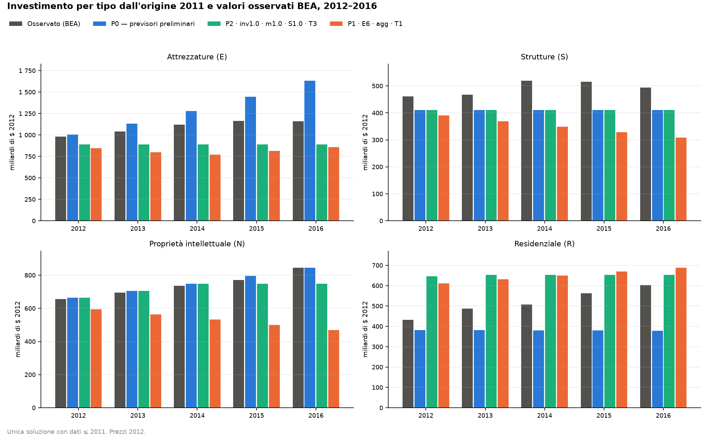
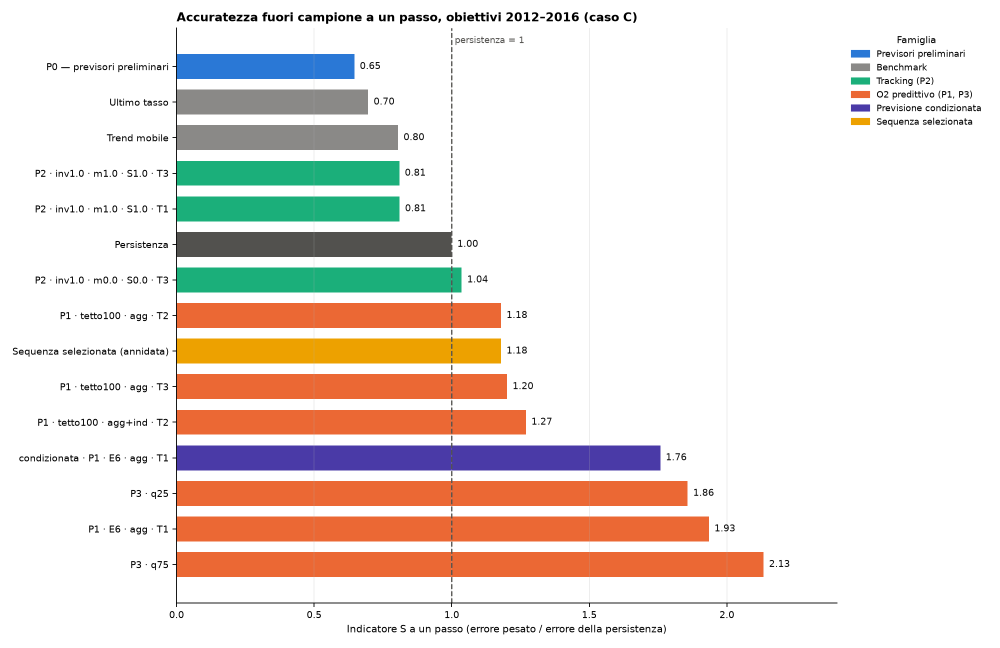

# M71-E6-predittivo — rapporto tecnico

Esecuzione `20260923-072127_M71-E6-predittivo`; commit `4e163597d3b8e7f660cf7a2a33ace20797eb07a0`; ambiente {'numpy': '2.5.3', 'pandas': '3.0.6', 'openpyxl': '3.1.5', 'highspy': '1.15.1'}.

## 1. Natura dell'esperimento

- **Pseudo-previsione fuori campione:** i dati BEA, Fed e BLS sono le versioni revisionate dell'archivio (2025-2026), non i vintage disponibili alle rispettive date. Nessun vintage storico è nell'archivio: la previsione real-time non è possibile.
- **Previsione completa:** tutte le grandezze future sono previste da dati ≤ τ (previsori preliminari selezionati su origini < τ).
- **Previsione condizionata:** solo il caso `condizionata|…` riceve le esogene future osservate (lavoro, domanda pubblica, esportazioni, importazioni, obiettivi di consumo, coefficienti tecnici). Misura l'allocazione, non la previsione ex ante.
- **Adattamento in-sample:** E6 originale (2012-2016) usa dati 2012-2019 nella calibrazione ed è riportato come confronto in-sample.
- **Orizzonte mobile (closed loop):** a ogni origine lo stato è quello osservato; nessuna simulazione open-loop è usata nelle metriche.
- **Intervallo ammesso:** 2008 ≤ τ < τ+h ≤ 2019; origini [2008, 2009, 2010, 2011, 2012, 2013, 2014, 2015, 2016, 2017, 2018]; H massimo 5.
- **Regime di shock:** origini 2008 e 2009 (obiettivi 2009-2010) contrassegnate; protocollo B = obiettivi 2010-2019; C = 2012-2016.

## 2. Audit dell'informazione

| nome | definizione | fonte | unita | frequenza | periodo_disponibile | data_massima_usata | disponibilita_reale | ruolo | anticipazione |
|---|---|---|---|---|---|---|---|---|---|
| B_t | coefficienti di uso intermedio per unità di produzione (Use/Make Summary, prezzi 2012) | BEA IO Summary before redefinitions (release 2025-09) | adimensionale | annuale | 1997-2024 | τ | tavole annuali t pubblicate ~t+1 (fine), riviste per ~3 anni | parametro strutturale (persistenza di B_τ) | nessuna: valori revisionati (pseudo-real-time) |
| D_t | quote di mercato industria × prodotto (Make) | BEA IO Summary | adimensionale | annuale | 1997-2024 | τ | come B_t | parametro strutturale (persistenza) | revisioni ex post |
| x_speciali | produzione dovuta a Used/Other | BEA IO Summary | mld $ 2012 | annuale | 1997-2024 | τ | come B_t | parametro strutturale (persistenza) | revisioni ex post |
| consumo per prodotto | F010 a prezzi 2012 | BEA IO Summary + GDPbyIndustry tab. 18 | mld $ 2012 | annuale | 1997-2024 | τ (previsto oltre) | come B_t | esogena prevista: obiettivi O2 = ĉ_{c,t|τ} (totale previsto × quote a τ) | nessuna (previsioni da dati ≤ τ) |
| obiettivi O2 | ĉ_{c,t|τ} | derivati | mld $ 2012 | annuale | - | τ | - | esogena prevista | nessuna |
| FTE per industria | occupati equivalenti a tempo pieno (NIPA 6.5D) | BEA NIPA T60500D (API 2026-09-23) | migliaia | annuale | 1998-2024 | τ | NIPA annuale pubblicato ~t+1 (luglio), rivisto | esogena prevista (L_t) e parametro (ℓ_j, coefficienti previsti) | revisioni ex post |
| importazioni totali | somma di −F050 (voci negative) | BEA IO Summary | mld $ 2012 | annuale | 1997-2024 | τ | come B_t | esogena prevista (tetto M̄_t) | revisioni ex post |
| quote d'importazione μ | importazioni / usi per prodotto | derivate | adimensionale | annuale | - | τ | - | parametro strutturale (persistenza di μ_τ) | nessuna |
| spesa pubblica | F06C/S/E/N, F07*, F10* (consumi e investimenti pubblici) | BEA IO Summary | mld $ 2012 | annuale | 1997-2024 | τ | come B_t | esogena prevista (totale × quote a τ) | revisioni ex post |
| investimento pubblico | compreso nelle colonne F06E/N, F07E/N, F10E/N | BEA IO Summary | mld $ 2012 | annuale | 1997-2024 | τ | come B_t | esogena prevista | revisioni ex post |
| esportazioni | F040 | BEA IO Summary | mld $ 2012 | annuale | 1997-2024 | τ | come B_t | esogena prevista | revisioni ex post |
| componenti esogene di F050 | voci positive di F050 | BEA IO Summary | mld $ 2012 | annuale | 1997-2024 | τ | come B_t | esogena prevista | revisioni ex post |
| stock di capitale K | stock netto di fine anno per industria FA × tipo, a prezzi 2012 (serie elementari) | BEA Fixed Assets detailnonres_stk1/2, detailresidential | mld $ 2012 | annuale | 1947-2024 (usato 1996-2019) | τ (fine anno) | FA annuali pubblicati ~t+1 (agosto-settembre), rivisti | stato noto a τ (K0 = fine τ); osservato oltre τ solo per la valutazione | revisioni ex post |
| investimento per industria e tipo | FA detailnonres_inv1/2, residenziale | BEA Fixed Assets | mld $ 2012 | annuale | 1947-2024 | τ | come K | stato noto (I_τ per la gradualità); previsto per P0/P2; endogeno nel modello | revisioni ex post |
| tassi di deprezzamento δ | D/K medio degli ultimi 5 anni ≤ τ | BEA Fixed Assets dep1/2 | annuo | annuale | 1947-2024 | τ | come K | parametro strutturale | nessuna |
| Φ per tipo | composizione per prodotto dell'investimento (GRAS su Use F02*, bridge PEQ, dettaglio FA) | BEA IO Summary + PEQ bridge + FA | prodotti per unità di I | annuale | 1997-2024 | τ | come B_t | parametro strutturale (persistenza di Φ_τ) | revisioni ex post |
| pesi di capacità w | costi d'uso (r di gruppo KLEMS + δ) calibrati nell'anno τ | BEA-BLS KLEMS 1997-2024 (release 2026-09-18) | adimensionale | annuale | 1997-2024 | τ | KLEMS pubblicato ~t+1/t+2 | parametro strutturale | revisioni ex post |
| coefficienti di capacità κ, θ (G.17) | κ da K^cap_τ, u_τ, x_τ; θ dalla deriva capacità G.17 / K^cap su [τ−5, τ] | Fed G.17 capacity, utilization (release 2026-09-18) | adimensionale | mensile → media annua | 1967/1972-2026 (usato 1997-2019) | τ | G.17 mensile con ritardo ~1 mese, rivisto annualmente | stato noto / parametro strutturale | revisioni ex post |
| tendenze non-G.17 (inviluppo) | log r = α + g t + e su [1997, τ], massimo residuo | derivate | adimensionale | annuale | - | τ | - | parametro strutturale (H9c non anticipativa) | nessuna: stimata solo su dati ≤ τ |
| scorte per comparto | stock di fine anno IV trim., 11 comparti, prezzi 2012 (5.8.5B, 5.8.9B) | BEA NIPA T50805B, T50809B | mld $ 2012 | trimestrale → fine anno | 1996Q4-2026Q2 (usato ≤ 2019) | τ | NIPA trimestrale ~t+1 mese | stato noto (S0 = fine τ); previsto per P2/P0 | revisioni ex post |
| rapporti scorte/produzione σ | S_z,τ / Σ x_j,τ | derivate | adimensionale | annuale | - | τ | - | parametro strutturale (persistenza) | nessuna |
| fattori terminali | T1: L̂_{τ+H}/L_τ (FTE previsti), x̂_HS/x_HS; T2/T3: valore v = 1 | derivati da previsioni a τ | adimensionale | - | - | τ | - | chiusura terminale non anticipativa | nessuna |
| prezzi / valore dello stock | stock in miliardi di dollari 2012: v = 1 (T2); nessun costo d'uso come valore | - | mld $ 2012 | - | - | - | - | chiusura T2/T3 | nessuna |
| indici di prezzo (deflazione) | indici della produzione lorda per industria, base 2012 = 1 | BEA GDPbyIndustry tab. 18 | indice | annuale | 1997-2025 | τ (anno da deflazionare) | pubblicati ~t+1 | convenzione di unità: prezzi 2012 anche per τ < 2012 (riscalatura, non informazione sui volumi) | la base 2012 è una scelta di unità; le quantità reali di ogni anno usano solo il deflatore di quell'anno |

Regole applicate: nessuna tendenza di capacità stimata oltre τ; crescita degli FTE prevista, non osservata; obiettivi O2 = consumo previsto; B, D, Φ, μ, σ persistenti dall'anno τ; iperparametri scelti solo su origini precedenti l'origine di test.

## 3. Classificazione delle variabili

| Categoria | Grandezze |
|---|---|
| stato noto a tau | K0 (stock di fine τ); S0 (scorte di fine τ); I_prec (investimento di τ); capacità installata (κ da K^cap_τ, x_τ, u_τ) |
| parametro strutturale | B_τ; D_τ; x_speciali_τ; δ (media 5 anni); Φ_τ, φR_τ; ℓ_j (coefficienti di lavoro, previsti per industria); w (costi d'uso a τ); θ (deriva G.17 e tendenza inviluppo); σ_z; ψ (composizione delle scorte); μ_c (quote d'importazione) |
| esogena prevista | L_t (FTE totali); G_t (spesa e investimento pubblici); X_t (esportazioni); F⁺_t; M̄_t (importazioni totali); ĉ_{c,t|τ} (obiettivi O2); x̂_{j,t|τ} (tracking P2); Î_{a,t|τ}, Ŝ_{z,t|τ} (tracking P2 esteso) |
| endogena | x; q; c; I_{j,a}; K_{t+1}; m; S_z, ΔS_z; r (residuo materiale) |

## 4. Formulazioni e griglia

- P0: previsioni preliminari (metodo selezionato per serie) senza riconciliazione.
- P1: O2 con obiettivi ĉ; tratti (E6, stretto, largo, tetto100, tetto110) × gradualità (agg, agg+ind, ind, nessuna) × chiusura (T1, T2, T3).
- P2: tracking L1 (LP con deviazioni assolute; nessun QP): λ_x ∈ {0,5; 2}, λ_I ∈ {0,1; 0,5}, T1/T3; varianti con tracking di investimento, importazioni e scorte previsti; variante a pesi uniformi.
- P3: P1 di riferimento con lavoro e importazioni totali al quantile 0,25 / 0,75 dei rapporti osservato/previsto di validazione.
- Benchmark: persistenza, ultimo tasso, trend mobile (5 anni), P0; E6 in-sample.
- Configurazioni LP per origine: 73 + 2 robuste + 1 condizionata; risoluzioni totali 825, tempo medio 4.4 s, massimo 8.3 s.

## 5. Risultati (indicatore S = Σ α_g WMAE_g / WMAE_g(persistenza); < 1 batte la persistenza)

Pesi α: produzione 0,30; consumo 0,30; investimento per tipo 0,20; stock per tipo 0,10; importazioni 0,05; scorte 0,05. Le componenti r_g sono riportate accanto a S.

### A_2008_2019

h = 1:

| caso | S | r_produzione | r_consumo | r_investimento_tipo | r_stock_tipo | r_importazioni | r_scorte |
|---|---|---|---|---|---|---|---|
| P0 | 0.757 | 0.817 | 0.760 | 0.766 | 0.294 | 1.142 | 0.883 |
| ultimo_tasso | 0.852 | 0.932 | 0.887 | 0.804 | 0.294 | 1.364 | 0.956 |
| trend_mobile | 0.863 | 0.934 | 0.774 | 0.943 | 0.598 | 1.106 | 0.950 |
| persistenza | 1.000 | 1.000 | 1.000 | 1.000 | 1.000 | 1.000 | 1.000 |
| P2|inv1.0|m1.0|S1.0|T3 | 1.048 | 1.035 | 1.049 | 1.259 | 0.717 | 1.092 | 0.891 |
| P2|inv1.0|m1.0|S1.0|T1 | 1.051 | 1.033 | 1.049 | 1.277 | 0.719 | 1.092 | 0.891 |
| P1|tetto100|agg|T2 | 1.236 | 1.367 | 1.079 | 0.683 | 0.253 | 2.629 | 4.187 |
| P2|inv1.0|m0.0|S0.0|T3 | 1.239 | 1.037 | 1.039 | 1.255 | 0.715 | 2.109 | 3.756 |
| P2|inv1.0|m0.0|S0.0|T1 | 1.244 | 1.037 | 1.041 | 1.266 | 0.716 | 2.106 | 3.814 |
| P2|lx2.0|li0.5|T3 | 1.250 | 1.017 | 1.080 | 1.438 | 0.740 | 1.852 | 3.336 |
| selezionata | 1.284 | 1.277 | 1.087 | 1.227 | 0.569 | 2.203 | 3.243 |
| condizionata|P1|E6|agg|T1 | 1.568 | 1.161 | 2.120 | 1.052 | 0.354 | 3.157 | 3.589 |
| P1|E6|agg|T1 | 2.019 | 1.592 | 2.334 | 2.039 | 0.842 | 3.485 | 3.484 |

h = 2:

| caso | S | r_produzione | r_consumo | r_investimento_tipo | r_stock_tipo | r_importazioni | r_scorte |
|---|---|---|---|---|---|---|---|
| P0 | 0.796 | 0.850 | 0.780 | 0.823 | 0.379 | 1.208 | 0.885 |
| trend_mobile | 0.894 | 0.983 | 0.745 | 0.990 | 0.669 | 1.198 | 1.013 |
| ultimo_tasso | 0.956 | 1.082 | 0.914 | 0.898 | 0.379 | 1.790 | 0.997 |
| P1|tetto100|agg+ind|T2 | 0.972 | 0.970 | 0.965 | 0.801 | 0.357 | 1.676 | 2.235 |
| P1|tetto100|agg|T2 | 0.972 | 1.109 | 0.948 | 0.590 | 0.289 | 1.866 | 2.294 |
| P2|inv1.0|m1.0|S1.0|T3 | 0.973 | 0.900 | 1.000 | 1.090 | 0.840 | 1.126 | 0.899 |
| P2|inv1.0|m1.0|S1.0|T1 | 0.974 | 0.894 | 1.000 | 1.103 | 0.842 | 1.126 | 0.899 |
| persistenza | 1.000 | 1.000 | 1.000 | 1.000 | 1.000 | 1.000 | 1.000 |
| P1|stretto|agg+ind|T2 | 1.035 | 1.028 | 1.068 | 0.865 | 0.359 | 1.743 | 2.203 |
| P1|tetto100|ind|T2 | 1.035 | 1.007 | 0.857 | 1.162 | 0.592 | 1.425 | 2.266 |
| selezionata | 1.037 | 1.067 | 0.910 | 1.006 | 0.657 | 1.510 | 2.020 |
| condizionata|P1|E6|agg|T1 | 1.043 | 0.991 | 0.917 | 0.896 | 0.442 | 3.016 | 1.927 |
| P1|E6|agg|T1 | 1.563 | 1.527 | 1.397 | 1.686 | 0.975 | 2.734 | 2.295 |

h = 3:

| caso | S | r_produzione | r_consumo | r_investimento_tipo | r_stock_tipo | r_importazioni | r_scorte |
|---|---|---|---|---|---|---|---|
| P0 | 0.849 | 0.870 | 0.837 | 0.925 | 0.425 | 1.266 | 0.911 |
| condizionata|P1|E6|agg|T1 | 0.871 | 0.788 | 0.758 | 0.796 | 0.502 | 2.445 | 1.512 |
| P1|tetto100|agg|T2 | 0.922 | 1.043 | 0.937 | 0.654 | 0.321 | 1.594 | 1.713 |
| P1|tetto100|agg+ind|T2 | 0.935 | 0.933 | 0.971 | 0.843 | 0.414 | 1.501 | 1.580 |
| trend_mobile | 0.954 | 1.043 | 0.797 | 1.074 | 0.716 | 1.267 | 1.040 |
| P1|tetto110|agg+ind|T2 | 0.966 | 0.970 | 1.029 | 0.894 | 0.425 | 1.290 | 1.616 |
| P1|stretto|agg+ind|T2 | 0.967 | 0.968 | 1.015 | 0.912 | 0.426 | 1.298 | 1.630 |
| P1|tetto100|ind|T2 | 0.995 | 0.984 | 0.908 | 1.060 | 0.645 | 1.425 | 1.601 |
| P2|inv1.0|m1.0|S1.0|T3 | 0.999 | 0.913 | 1.064 | 1.078 | 0.904 | 1.080 | 0.926 |
| P2|inv1.0|m1.0|S1.0|T1 | 0.999 | 0.912 | 1.064 | 1.079 | 0.903 | 1.080 | 0.926 |
| persistenza | 1.000 | 1.000 | 1.000 | 1.000 | 1.000 | 1.000 | 1.000 |
| selezionata | 1.032 | 1.054 | 0.941 | 0.988 | 0.746 | 1.502 | 1.730 |
| ultimo_tasso | 1.054 | 1.175 | 0.945 | 1.096 | 0.425 | 1.988 | 1.140 |
| P1|E6|agg|T1 | 1.408 | 1.319 | 1.258 | 1.629 | 1.093 | 2.193 | 1.794 |

h = 4:

| caso | S | r_produzione | r_consumo | r_investimento_tipo | r_stock_tipo | r_importazioni | r_scorte |
|---|---|---|---|---|---|---|---|
| condizionata|P1|E6|agg|T1 | 0.774 | 0.701 | 0.671 | 0.711 | 0.533 | 2.015 | 1.321 |
| P0 | 0.921 | 0.920 | 0.905 | 1.035 | 0.486 | 1.418 | 0.937 |
| P1|tetto100|agg|T2 | 0.923 | 1.068 | 0.952 | 0.674 | 0.364 | 1.534 | 1.391 |
| P1|tetto100|agg+ind|T2 | 0.942 | 0.986 | 0.986 | 0.883 | 0.502 | 1.176 | 1.288 |
| P1|tetto110|agg+ind|T2 | 0.971 | 1.011 | 1.005 | 0.905 | 0.516 | 1.216 | 1.458 |
| P1|stretto|agg+ind|T2 | 0.975 | 1.013 | 0.999 | 0.918 | 0.515 | 1.239 | 1.478 |
| P1|tetto100|ind|T2 | 0.991 | 1.021 | 0.935 | 1.049 | 0.724 | 1.107 | 1.337 |
| P1|tetto110|agg|T2 | 0.991 | 1.196 | 0.982 | 0.756 | 0.343 | 1.713 | 1.337 |
| P1|stretto|agg|T2 | 0.996 | 1.203 | 0.958 | 0.767 | 0.347 | 1.784 | 1.411 |
| persistenza | 1.000 | 1.000 | 1.000 | 1.000 | 1.000 | 1.000 | 1.000 |
| selezionata | 1.029 | 1.071 | 0.966 | 0.916 | 0.815 | 1.593 | 1.469 |
| trend_mobile | 1.035 | 1.115 | 0.876 | 1.188 | 0.764 | 1.435 | 1.034 |
| ultimo_tasso | 1.175 | 1.312 | 1.027 | 1.247 | 0.486 | 2.319 | 1.195 |
| P1|E6|agg|T1 | 1.348 | 1.241 | 1.258 | 1.571 | 1.199 | 1.821 | 1.473 |

h = 5:

| caso | S | r_produzione | r_consumo | r_investimento_tipo | r_stock_tipo | r_importazioni | r_scorte |
|---|---|---|---|---|---|---|---|
| condizionata|P1|E6|agg|T1 | 0.755 | 0.711 | 0.756 | 0.625 | 0.529 | 1.902 | 0.840 |
| P1|stretto|agg+ind|T2 | 0.976 | 1.063 | 0.981 | 0.965 | 0.604 | 1.183 | 1.000 |
| P1|tetto110|agg+ind|T2 | 0.977 | 1.068 | 0.993 | 0.944 | 0.607 | 1.177 | 1.000 |
| P1|tetto100|agg|T2 | 0.990 | 1.223 | 1.010 | 0.678 | 0.381 | 1.944 | 0.997 |
| P1|tetto100|agg+ind|T2 | 0.992 | 1.096 | 1.049 | 0.937 | 0.596 | 1.037 | 1.000 |
| P0 | 0.995 | 0.966 | 0.968 | 1.148 | 0.549 | 1.678 | 0.920 |
| persistenza | 1.000 | 1.000 | 1.000 | 1.000 | 1.000 | 1.000 | 1.000 |
| P1|E6|agg+ind|T2 | 1.013 | 1.102 | 1.068 | 0.966 | 0.615 | 1.165 | 0.980 |
| P1|tetto110|ind|T2 | 1.028 | 1.110 | 0.966 | 1.109 | 0.827 | 1.022 | 0.992 |
| P1|stretto|ind|T2 | 1.037 | 1.118 | 0.947 | 1.142 | 0.886 | 1.015 | 0.992 |
| selezionata | 1.081 | 1.192 | 1.029 | 0.905 | 0.883 | 1.910 | 0.993 |
| trend_mobile | 1.099 | 1.174 | 0.979 | 1.200 | 0.789 | 1.697 | 0.977 |
| ultimo_tasso | 1.311 | 1.482 | 1.109 | 1.436 | 0.549 | 2.687 | 1.143 |
| P1|E6|agg|T1 | 1.363 | 1.299 | 1.230 | 1.608 | 1.321 | 2.037 | 0.968 |

Aggregati, h = 1 (MAE, RMSE, sMAPE, errore sui tassi, accuratezza del segno, Theil U):

| caso | MAE | RMSE | sMAPE | errore_tassi | segno | theil_U |
|---|---|---|---|---|---|---|
| condizionata|P1|E6|agg|T1 | 259.070 | 364.874 | 0.049 | 0.048 | 0.709 | 0.878 |
| ultimo_tasso | 178.032 | 396.609 | 0.033 | 0.032 | 0.836 | 0.955 |
| P2|lx0.5|li0.5|T1 | 208.615 | 377.462 | 0.038 | 0.038 | 0.764 | 0.909 |
| P2|lx0.5|li0.5|T3 | 208.152 | 377.642 | 0.037 | 0.038 | 0.764 | 0.909 |
| P2|inv1.0|m1.0|S1.0|T1 | 203.675 | 394.014 | 0.034 | 0.035 | 0.764 | 0.948 |
| P2|inv1.0|m1.0|S1.0|T3 | 203.332 | 393.664 | 0.034 | 0.035 | 0.764 | 0.948 |
| P2|lx0.5|li0.1|T1 | 204.387 | 384.766 | 0.039 | 0.038 | 0.745 | 0.926 |
| P2|lx0.5|li0.1|T3 | 204.879 | 382.734 | 0.038 | 0.038 | 0.745 | 0.921 |
| P2|inv1.0|m0.0|S0.0|T1 | 206.733 | 402.476 | 0.035 | 0.036 | 0.764 | 0.969 |
| P2|inv1.0|m0.0|S0.0|T3 | 207.575 | 402.191 | 0.036 | 0.036 | 0.764 | 0.968 |
| P2|lx2.0|li0.1|T3 | 217.848 | 387.695 | 0.039 | 0.038 | 0.745 | 0.933 |
| P2|lx2.0|li0.1|T1 | 221.118 | 392.270 | 0.040 | 0.040 | 0.745 | 0.944 |
| trend_mobile | 203.925 | 389.645 | 0.036 | 0.036 | 0.655 | 0.938 |
| P0 | 195.160 | 408.125 | 0.034 | 0.033 | 0.800 | 0.982 |

Per gruppo, h = 1 (WMAE e rapporto con la persistenza):

| gruppo | P0 | P1|E6|agg|T1 | persistenza | selezionata |
|---|---|---|---|---|
| aggregati | 0.679 | 0.875 | 1.000 | 0.977 |
| consumo | 0.760 | 2.334 | 1.000 | 1.087 |
| importazioni | 1.142 | 3.485 | 1.000 | 2.203 |
| investimento_ind | 0.862 | 6.341 | 1.000 | 5.093 |
| investimento_tipo | 0.766 | 2.039 | 1.000 | 1.227 |
| produzione | 0.817 | 1.592 | 1.000 | 1.277 |
| scorte | 0.883 | 3.484 | 1.000 | 3.243 |
| stock_ind | 0.338 | 1.492 | 1.000 | 1.137 |
| stock_tipo | 0.294 | 0.842 | 1.000 | 0.569 |

### B_2010_2019

h = 1:

| caso | S | r_produzione | r_consumo | r_investimento_tipo | r_stock_tipo | r_importazioni | r_scorte |
|---|---|---|---|---|---|---|---|
| P0 | 0.722 | 0.773 | 0.718 | 0.773 | 0.222 | 1.133 | 0.829 |
| trend_mobile | 0.804 | 0.894 | 0.710 | 0.890 | 0.463 | 1.073 | 0.889 |
| ultimo_tasso | 0.832 | 0.937 | 0.829 | 0.802 | 0.222 | 1.453 | 0.932 |
| P2|inv1.0|m1.0|S1.0|T3 | 0.982 | 0.981 | 1.022 | 1.169 | 0.533 | 1.041 | 0.834 |
| P2|inv1.0|m1.0|S1.0|T1 | 0.986 | 0.979 | 1.022 | 1.191 | 0.536 | 1.041 | 0.834 |
| persistenza | 1.000 | 1.000 | 1.000 | 1.000 | 1.000 | 1.000 | 1.000 |
| P2|inv1.0|m0.0|S0.0|T3 | 1.201 | 0.987 | 1.012 | 1.165 | 0.532 | 2.277 | 4.024 |
| P2|inv1.0|m0.0|S0.0|T1 | 1.205 | 0.987 | 1.014 | 1.177 | 0.533 | 2.271 | 4.056 |
| P2|lx2.0|li0.5|T3 | 1.207 | 0.953 | 1.047 | 1.372 | 0.554 | 1.942 | 3.607 |
| P2|lx0.5|li0.5|T3 | 1.228 | 1.017 | 1.046 | 1.366 | 0.552 | 1.758 | 3.860 |
| selezionata | 1.252 | 1.264 | 1.075 | 1.167 | 0.406 | 2.160 | 3.369 |
| condizionata|P1|E6|agg|T1 | 1.702 | 1.314 | 2.329 | 1.089 | 0.291 | 3.456 | 3.788 |
| P1|E6|agg|T1 | 2.110 | 1.647 | 2.482 | 2.173 | 0.689 | 3.710 | 3.652 |

h = 2:

| caso | S | r_produzione | r_consumo | r_investimento_tipo | r_stock_tipo | r_importazioni | r_scorte |
|---|---|---|---|---|---|---|---|
| P0 | 0.796 | 0.850 | 0.780 | 0.823 | 0.379 | 1.208 | 0.885 |
| trend_mobile | 0.894 | 0.983 | 0.745 | 0.990 | 0.669 | 1.198 | 1.013 |
| ultimo_tasso | 0.956 | 1.082 | 0.914 | 0.898 | 0.379 | 1.790 | 0.997 |
| P1|tetto100|agg+ind|T2 | 0.972 | 0.970 | 0.965 | 0.801 | 0.357 | 1.676 | 2.235 |
| P1|tetto100|agg|T2 | 0.972 | 1.109 | 0.948 | 0.590 | 0.289 | 1.866 | 2.294 |
| P2|inv1.0|m1.0|S1.0|T3 | 0.973 | 0.900 | 1.000 | 1.090 | 0.840 | 1.126 | 0.899 |
| P2|inv1.0|m1.0|S1.0|T1 | 0.974 | 0.894 | 1.000 | 1.103 | 0.842 | 1.126 | 0.899 |
| persistenza | 1.000 | 1.000 | 1.000 | 1.000 | 1.000 | 1.000 | 1.000 |
| P1|stretto|agg+ind|T2 | 1.035 | 1.028 | 1.068 | 0.865 | 0.359 | 1.743 | 2.203 |
| P1|tetto100|ind|T2 | 1.035 | 1.007 | 0.857 | 1.162 | 0.592 | 1.425 | 2.266 |
| selezionata | 1.037 | 1.067 | 0.910 | 1.006 | 0.657 | 1.510 | 2.020 |
| condizionata|P1|E6|agg|T1 | 1.043 | 0.991 | 0.917 | 0.896 | 0.442 | 3.016 | 1.927 |
| P1|E6|agg|T1 | 1.563 | 1.527 | 1.397 | 1.686 | 0.975 | 2.734 | 2.295 |

h = 3:

| caso | S | r_produzione | r_consumo | r_investimento_tipo | r_stock_tipo | r_importazioni | r_scorte |
|---|---|---|---|---|---|---|---|
| P0 | 0.849 | 0.870 | 0.837 | 0.925 | 0.425 | 1.266 | 0.911 |
| condizionata|P1|E6|agg|T1 | 0.871 | 0.788 | 0.758 | 0.796 | 0.502 | 2.445 | 1.512 |
| P1|tetto100|agg|T2 | 0.922 | 1.043 | 0.937 | 0.654 | 0.321 | 1.594 | 1.713 |
| P1|tetto100|agg+ind|T2 | 0.935 | 0.933 | 0.971 | 0.843 | 0.414 | 1.501 | 1.580 |
| trend_mobile | 0.954 | 1.043 | 0.797 | 1.074 | 0.716 | 1.267 | 1.040 |
| P1|tetto110|agg+ind|T2 | 0.966 | 0.970 | 1.029 | 0.894 | 0.425 | 1.290 | 1.616 |
| P1|stretto|agg+ind|T2 | 0.967 | 0.968 | 1.015 | 0.912 | 0.426 | 1.298 | 1.630 |
| P1|tetto100|ind|T2 | 0.995 | 0.984 | 0.908 | 1.060 | 0.645 | 1.425 | 1.601 |
| P2|inv1.0|m1.0|S1.0|T3 | 0.999 | 0.913 | 1.064 | 1.078 | 0.904 | 1.080 | 0.926 |
| P2|inv1.0|m1.0|S1.0|T1 | 0.999 | 0.912 | 1.064 | 1.079 | 0.903 | 1.080 | 0.926 |
| persistenza | 1.000 | 1.000 | 1.000 | 1.000 | 1.000 | 1.000 | 1.000 |
| selezionata | 1.032 | 1.054 | 0.941 | 0.988 | 0.746 | 1.502 | 1.730 |
| ultimo_tasso | 1.054 | 1.175 | 0.945 | 1.096 | 0.425 | 1.988 | 1.140 |
| P1|E6|agg|T1 | 1.408 | 1.319 | 1.258 | 1.629 | 1.093 | 2.193 | 1.794 |

h = 4:

| caso | S | r_produzione | r_consumo | r_investimento_tipo | r_stock_tipo | r_importazioni | r_scorte |
|---|---|---|---|---|---|---|---|
| condizionata|P1|E6|agg|T1 | 0.774 | 0.701 | 0.671 | 0.711 | 0.533 | 2.015 | 1.321 |
| P0 | 0.921 | 0.920 | 0.905 | 1.035 | 0.486 | 1.418 | 0.937 |
| P1|tetto100|agg|T2 | 0.923 | 1.068 | 0.952 | 0.674 | 0.364 | 1.534 | 1.391 |
| P1|tetto100|agg+ind|T2 | 0.942 | 0.986 | 0.986 | 0.883 | 0.502 | 1.176 | 1.288 |
| P1|tetto110|agg+ind|T2 | 0.971 | 1.011 | 1.005 | 0.905 | 0.516 | 1.216 | 1.458 |
| P1|stretto|agg+ind|T2 | 0.975 | 1.013 | 0.999 | 0.918 | 0.515 | 1.239 | 1.478 |
| P1|tetto100|ind|T2 | 0.991 | 1.021 | 0.935 | 1.049 | 0.724 | 1.107 | 1.337 |
| P1|tetto110|agg|T2 | 0.991 | 1.196 | 0.982 | 0.756 | 0.343 | 1.713 | 1.337 |
| P1|stretto|agg|T2 | 0.996 | 1.203 | 0.958 | 0.767 | 0.347 | 1.784 | 1.411 |
| persistenza | 1.000 | 1.000 | 1.000 | 1.000 | 1.000 | 1.000 | 1.000 |
| selezionata | 1.029 | 1.071 | 0.966 | 0.916 | 0.815 | 1.593 | 1.469 |
| trend_mobile | 1.035 | 1.115 | 0.876 | 1.188 | 0.764 | 1.435 | 1.034 |
| ultimo_tasso | 1.175 | 1.312 | 1.027 | 1.247 | 0.486 | 2.319 | 1.195 |
| P1|E6|agg|T1 | 1.348 | 1.241 | 1.258 | 1.571 | 1.199 | 1.821 | 1.473 |

h = 5:

| caso | S | r_produzione | r_consumo | r_investimento_tipo | r_stock_tipo | r_importazioni | r_scorte |
|---|---|---|---|---|---|---|---|
| condizionata|P1|E6|agg|T1 | 0.755 | 0.711 | 0.756 | 0.625 | 0.529 | 1.902 | 0.840 |
| P1|stretto|agg+ind|T2 | 0.976 | 1.063 | 0.981 | 0.965 | 0.604 | 1.183 | 1.000 |
| P1|tetto110|agg+ind|T2 | 0.977 | 1.068 | 0.993 | 0.944 | 0.607 | 1.177 | 1.000 |
| P1|tetto100|agg|T2 | 0.990 | 1.223 | 1.010 | 0.678 | 0.381 | 1.944 | 0.997 |
| P1|tetto100|agg+ind|T2 | 0.992 | 1.096 | 1.049 | 0.937 | 0.596 | 1.037 | 1.000 |
| P0 | 0.995 | 0.966 | 0.968 | 1.148 | 0.549 | 1.678 | 0.920 |
| persistenza | 1.000 | 1.000 | 1.000 | 1.000 | 1.000 | 1.000 | 1.000 |
| P1|E6|agg+ind|T2 | 1.013 | 1.102 | 1.068 | 0.966 | 0.615 | 1.165 | 0.980 |
| P1|tetto110|ind|T2 | 1.028 | 1.110 | 0.966 | 1.109 | 0.827 | 1.022 | 0.992 |
| P1|stretto|ind|T2 | 1.037 | 1.118 | 0.947 | 1.142 | 0.886 | 1.015 | 0.992 |
| selezionata | 1.081 | 1.192 | 1.029 | 0.905 | 0.883 | 1.910 | 0.993 |
| trend_mobile | 1.099 | 1.174 | 0.979 | 1.200 | 0.789 | 1.697 | 0.977 |
| ultimo_tasso | 1.311 | 1.482 | 1.109 | 1.436 | 0.549 | 2.687 | 1.143 |
| P1|E6|agg|T1 | 1.363 | 1.299 | 1.230 | 1.608 | 1.321 | 2.037 | 0.968 |

Aggregati, h = 1 (MAE, RMSE, sMAPE, errore sui tassi, accuratezza del segno, Theil U):

| caso | MAE | RMSE | sMAPE | errore_tassi | segno | theil_U |
|---|---|---|---|---|---|---|
| P2|inv1.0|m1.0|S1.0|T1 | 152.178 | 284.911 | 0.024 | 0.024 | 0.820 | 0.782 |
| P2|lx0.5|li0.5|T1 | 160.651 | 261.951 | 0.028 | 0.029 | 0.800 | 0.719 |
| P2|inv1.0|m1.0|S1.0|T3 | 151.678 | 283.881 | 0.023 | 0.024 | 0.820 | 0.779 |
| P2|lx0.5|li0.5|T3 | 159.992 | 261.606 | 0.028 | 0.029 | 0.800 | 0.718 |
| P2|inv1.0|m0.0|S0.0|T1 | 156.053 | 297.268 | 0.025 | 0.026 | 0.820 | 0.816 |
| P2|inv1.0|m0.0|S0.0|T3 | 157.147 | 297.128 | 0.025 | 0.026 | 0.820 | 0.815 |
| trend_mobile | 155.657 | 266.687 | 0.028 | 0.028 | 0.720 | 0.732 |
| ultimo_tasso | 155.461 | 371.760 | 0.028 | 0.029 | 0.820 | 1.020 |
| P2|lx0.5|li0.1|T3 | 167.873 | 308.898 | 0.031 | 0.031 | 0.780 | 0.848 |
| P1|tetto110|ind|T1 | 206.667 | 333.537 | 0.044 | 0.043 | 0.720 | 0.915 |
| P2|lx0.5|li0.1|T1 | 172.214 | 324.765 | 0.032 | 0.032 | 0.760 | 0.891 |
| condizionata|P1|E6|agg|T1 | 262.277 | 373.253 | 0.048 | 0.048 | 0.700 | 1.024 |
| P1|tetto110|ind|T3 | 211.331 | 334.669 | 0.044 | 0.044 | 0.720 | 0.918 |
| P2|lx2.0|li0.5|T1 | 185.264 | 338.487 | 0.029 | 0.030 | 0.780 | 0.929 |

Per gruppo, h = 1 (WMAE e rapporto con la persistenza):

| gruppo | P0 | P1|E6|agg|T1 | persistenza | selezionata |
|---|---|---|---|---|
| aggregati | 0.658 | 0.790 | 1.000 | 0.913 |
| consumo | 0.718 | 2.482 | 1.000 | 1.075 |
| importazioni | 1.133 | 3.710 | 1.000 | 2.160 |
| investimento_ind | 1.040 | 7.065 | 1.000 | 5.405 |
| investimento_tipo | 0.773 | 2.173 | 1.000 | 1.167 |
| produzione | 0.773 | 1.647 | 1.000 | 1.264 |
| scorte | 0.829 | 3.652 | 1.000 | 3.369 |
| stock_ind | 0.264 | 1.157 | 1.000 | 0.797 |
| stock_tipo | 0.222 | 0.689 | 1.000 | 0.406 |

### C_2012_2016

h = 1:

| caso | S | r_produzione | r_consumo | r_investimento_tipo | r_stock_tipo | r_importazioni | r_scorte |
|---|---|---|---|---|---|---|---|
| P0 | 0.646 | 0.653 | 0.726 | 0.584 | 0.231 | 1.115 | 0.729 |
| ultimo_tasso | 0.696 | 0.721 | 0.744 | 0.642 | 0.231 | 1.353 | 0.748 |
| trend_mobile | 0.805 | 0.878 | 0.730 | 0.921 | 0.442 | 1.068 | 0.809 |
| P2|inv1.0|m1.0|S1.0|T3 | 0.809 | 0.845 | 0.910 | 0.808 | 0.311 | 1.013 | 0.788 |
| P2|inv1.0|m1.0|S1.0|T1 | 0.810 | 0.846 | 0.912 | 0.808 | 0.311 | 1.013 | 0.788 |
| persistenza | 1.000 | 1.000 | 1.000 | 1.000 | 1.000 | 1.000 | 1.000 |
| P2|inv1.0|m0.0|S0.0|T3 | 1.036 | 0.849 | 0.909 | 0.804 | 0.307 | 2.405 | 3.934 |
| P2|inv1.0|m0.0|S0.0|T1 | 1.045 | 0.852 | 0.908 | 0.804 | 0.307 | 2.542 | 3.975 |
| P2|lx0.5|li0.5|T3 | 1.066 | 0.871 | 0.899 | 1.157 | 0.374 | 1.666 | 3.653 |
| P2|lx0.5|li0.5|T1 | 1.079 | 0.864 | 0.899 | 1.159 | 0.375 | 1.984 | 3.635 |
| selezionata | 1.179 | 1.437 | 0.870 | 0.553 | 0.149 | 2.654 | 4.569 |
| condizionata|P1|E6|agg|T1 | 1.758 | 1.348 | 2.453 | 0.978 | 0.276 | 3.921 | 3.964 |
| P1|E6|agg|T1 | 1.935 | 1.635 | 2.272 | 1.722 | 0.442 | 3.924 | 3.550 |

Aggregati, h = 1 (MAE, RMSE, sMAPE, errore sui tassi, accuratezza del segno, Theil U):

| caso | MAE | RMSE | sMAPE | errore_tassi | segno | theil_U |
|---|---|---|---|---|---|---|
| ultimo_tasso | 82.279 | 96.937 | 0.018 | 0.018 | 0.880 | 0.276 |
| P0 | 105.686 | 139.939 | 0.021 | 0.021 | 0.880 | 0.398 |
| P1|tetto110|ind|T1 | 146.260 | 186.762 | 0.032 | 0.032 | 0.760 | 0.531 |
| P1|stretto|ind|T1 | 157.026 | 197.750 | 0.035 | 0.035 | 0.720 | 0.563 |
| P2|inv1.0|m1.0|S1.0|T3 | 120.747 | 166.443 | 0.018 | 0.018 | 0.880 | 0.474 |
| P2|inv1.0|m1.0|S1.0|T1 | 120.892 | 166.646 | 0.018 | 0.018 | 0.880 | 0.474 |
| P2|inv1.0|m0.0|S0.0|T1 | 120.825 | 172.655 | 0.018 | 0.018 | 0.880 | 0.491 |
| P2|inv1.0|m0.0|S0.0|T3 | 122.419 | 173.697 | 0.018 | 0.019 | 0.880 | 0.494 |
| P1|tetto110|ind|T2 | 161.924 | 210.834 | 0.033 | 0.033 | 0.760 | 0.600 |
| P2|lx0.5|li0.1|T3 | 127.722 | 180.994 | 0.019 | 0.020 | 0.840 | 0.515 |
| P1|stretto|ind|T2 | 166.022 | 213.138 | 0.033 | 0.034 | 0.760 | 0.607 |
| P2|lx0.5|li0.1|T1 | 128.060 | 181.242 | 0.019 | 0.020 | 0.840 | 0.516 |
| P1|stretto|ind|T3 | 152.857 | 199.754 | 0.029 | 0.029 | 0.760 | 0.568 |
| P1|tetto110|ind|T3 | 152.747 | 198.211 | 0.029 | 0.029 | 0.760 | 0.564 |

Per gruppo, h = 1 (WMAE e rapporto con la persistenza):

| gruppo | P0 | P1|E6|agg|T1 | persistenza | selezionata |
|---|---|---|---|---|
| aggregati | 0.334 | 0.713 | 1.000 | 1.227 |
| consumo | 0.726 | 2.272 | 1.000 | 0.870 |
| importazioni | 1.115 | 3.924 | 1.000 | 2.654 |
| investimento_ind | 0.756 | 3.486 | 1.000 | 3.571 |
| investimento_tipo | 0.584 | 1.722 | 1.000 | 0.553 |
| produzione | 0.653 | 1.635 | 1.000 | 1.437 |
| scorte | 0.729 | 3.550 | 1.000 | 4.569 |
| stock_ind | 0.327 | 0.753 | 1.000 | 0.488 |
| stock_tipo | 0.231 | 0.442 | 1.000 | 0.149 |

### C_2012_2016_origine_2011

h = 1:

| caso | S | r_produzione | r_consumo | r_investimento_tipo | r_stock_tipo | r_importazioni | r_scorte |
|---|---|---|---|---|---|---|---|
| ultimo_tasso | 0.672 | 0.857 | 0.740 | 0.436 | 0.418 | 0.680 | 0.597 |
| P0 | 0.742 | 0.732 | 1.070 | 0.479 | 0.418 | 0.633 | 0.656 |
| persistenza | 1.000 | 1.000 | 1.000 | 1.000 | 1.000 | 1.000 | 1.000 |
| P2|inv1.0|m1.0|S1.0|T3 | 1.047 | 0.829 | 0.937 | 1.355 | 1.672 | 0.763 | 0.810 |
| P2|inv1.0|m1.0|S1.0|T1 | 1.047 | 0.830 | 0.937 | 1.355 | 1.672 | 0.763 | 0.810 |
| trend_mobile | 1.081 | 1.208 | 1.156 | 1.205 | 0.379 | 0.808 | 1.061 |
| P2|lx0.5|li0.5|T3 | 1.182 | 0.874 | 0.939 | 1.427 | 1.626 | 1.041 | 2.762 |
| P1|tetto100|agg|T2 | 1.204 | 1.740 | 0.888 | 0.475 | 0.235 | 1.503 | 4.428 |
| P2|lx0.5|li0.1|T3 | 1.210 | 0.837 | 0.937 | 1.421 | 1.612 | 1.162 | 3.491 |
| P2|lx0.5|li0.1|T1 | 1.212 | 0.833 | 0.937 | 1.498 | 1.752 | 1.067 | 3.052 |
| condizionata|P1|E6|agg|T1 | 1.585 | 1.471 | 2.050 | 0.632 | 0.249 | 2.787 | 4.767 |
| P1|E6|agg|T1 | 1.958 | 1.551 | 2.084 | 1.840 | 1.676 | 2.704 | 3.929 |

h = 2:

| caso | S | r_produzione | r_consumo | r_investimento_tipo | r_stock_tipo | r_importazioni | r_scorte |
|---|---|---|---|---|---|---|---|
| P1|tetto100|agg|T2 | 0.775 | 0.945 | 0.792 | 0.379 | 0.292 | 0.627 | 2.347 |
| P1|tetto100|ind|T1 | 0.810 | 0.814 | 0.613 | 0.652 | 1.040 | 0.790 | 2.159 |
| P2|inv1.0|m1.0|S1.0|T1 | 0.827 | 0.808 | 0.591 | 0.948 | 1.187 | 1.197 | 0.787 |
| P2|inv1.0|m1.0|S1.0|T3 | 0.832 | 0.829 | 0.585 | 0.948 | 1.188 | 1.197 | 0.787 |
| P1|tetto100|ind|T2 | 0.835 | 0.759 | 0.792 | 0.553 | 0.594 | 1.844 | 2.148 |
| P1|tetto100|agg+ind|T1 | 0.852 | 0.764 | 0.590 | 0.743 | 1.029 | 1.447 | 2.436 |
| P0 | 0.853 | 0.864 | 1.086 | 0.638 | 0.544 | 1.102 | 0.619 |
| condizionata|P1|E6|agg|T1 | 0.863 | 0.946 | 0.615 | 0.476 | 0.292 | 3.764 | 1.632 |
| P1|stretto|agg+ind|T3 | 0.874 | 0.788 | 0.685 | 0.780 | 1.030 | 0.983 | 2.470 |
| ultimo_tasso | 0.876 | 1.132 | 0.765 | 0.588 | 0.544 | 2.005 | 0.697 |
| persistenza | 1.000 | 1.000 | 1.000 | 1.000 | 1.000 | 1.000 | 1.000 |
| trend_mobile | 1.155 | 1.251 | 1.207 | 1.221 | 0.475 | 1.397 | 1.134 |
| P1|E6|agg|T1 | 1.368 | 1.115 | 1.050 | 1.624 | 1.268 | 3.000 | 2.332 |

h = 3:

| caso | S | r_produzione | r_consumo | r_investimento_tipo | r_stock_tipo | r_importazioni | r_scorte |
|---|---|---|---|---|---|---|---|
| condizionata|P1|E6|agg|T1 | 0.719 | 0.761 | 0.712 | 0.454 | 0.328 | 1.754 | 1.305 |
| P1|tetto100|agg|T2 | 0.733 | 0.853 | 0.747 | 0.390 | 0.325 | 1.107 | 1.740 |
| P1|tetto100|ind|T2 | 0.792 | 0.833 | 0.770 | 0.648 | 0.588 | 1.058 | 1.397 |
| P1|tetto100|agg+ind|T2 | 0.810 | 0.844 | 0.771 | 0.719 | 0.617 | 1.056 | 1.353 |
| P1|tetto100|agg+ind|T3 | 0.810 | 0.725 | 0.774 | 0.740 | 0.914 | 0.625 | 1.807 |
| P1|tetto100|ind|T3 | 0.819 | 0.787 | 0.776 | 0.660 | 0.874 | 0.905 | 1.715 |
| P1|tetto100|agg|T3 | 0.828 | 0.906 | 0.785 | 0.473 | 0.741 | 1.324 | 1.724 |
| P1|tetto100|ind|T1 | 0.830 | 0.784 | 0.779 | 0.697 | 0.858 | 0.923 | 1.789 |
| P1|tetto110|agg+ind|T2 | 0.836 | 0.852 | 0.865 | 0.726 | 0.629 | 0.575 | 1.675 |
| P1|stretto|agg+ind|T2 | 0.836 | 0.852 | 0.865 | 0.726 | 0.630 | 0.575 | 1.675 |
| P0 | 0.857 | 0.843 | 1.124 | 0.660 | 0.608 | 0.858 | 0.616 |
| ultimo_tasso | 0.880 | 1.134 | 0.804 | 0.610 | 0.608 | 1.620 | 0.694 |
| persistenza | 1.000 | 1.000 | 1.000 | 1.000 | 1.000 | 1.000 | 1.000 |
| trend_mobile | 1.201 | 1.299 | 1.354 | 1.202 | 0.513 | 1.130 | 1.139 |
| P1|E6|agg|T1 | 1.313 | 1.112 | 1.271 | 1.535 | 1.178 | 1.707 | 1.757 |

h = 4:

| caso | S | r_produzione | r_consumo | r_investimento_tipo | r_stock_tipo | r_importazioni | r_scorte |
|---|---|---|---|---|---|---|---|
| condizionata|P1|E6|agg|T1 | 0.589 | 0.541 | 0.605 | 0.382 | 0.349 | 1.470 | 1.217 |
| P1|tetto100|agg|T2 | 0.666 | 0.804 | 0.678 | 0.330 | 0.337 | 0.953 | 1.483 |
| P1|tetto100|agg|T3 | 0.763 | 0.914 | 0.807 | 0.338 | 0.620 | 0.884 | 1.452 |
| P1|tetto110|agg|T2 | 0.768 | 1.049 | 0.739 | 0.330 | 0.384 | 1.214 | 1.330 |
| P1|stretto|agg|T2 | 0.768 | 1.050 | 0.739 | 0.330 | 0.383 | 1.213 | 1.331 |
| P1|tetto100|ind|T2 | 0.789 | 0.927 | 0.718 | 0.710 | 0.632 | 0.793 | 1.016 |
| P1|tetto110|ind|T2 | 0.792 | 0.912 | 0.797 | 0.684 | 0.618 | 0.535 | 1.085 |
| P1|tetto100|ind|T3 | 0.793 | 0.816 | 0.812 | 0.627 | 0.715 | 0.781 | 1.374 |
| P1|stretto|ind|T2 | 0.797 | 0.912 | 0.797 | 0.684 | 0.618 | 0.535 | 1.176 |
| P1|tetto100|ind|T1 | 0.797 | 0.814 | 0.813 | 0.657 | 0.742 | 0.780 | 1.290 |
| P0 | 0.883 | 0.843 | 1.021 | 0.848 | 0.647 | 1.167 | 0.633 |
| ultimo_tasso | 0.974 | 1.267 | 0.749 | 0.792 | 0.647 | 2.134 | 0.795 |
| persistenza | 1.000 | 1.000 | 1.000 | 1.000 | 1.000 | 1.000 | 1.000 |
| P1|E6|agg|T1 | 1.137 | 1.001 | 1.097 | 1.339 | 1.076 | 1.242 | 1.395 |
| trend_mobile | 1.188 | 1.274 | 1.278 | 1.206 | 0.563 | 1.355 | 1.147 |

h = 5:

| caso | S | r_produzione | r_consumo | r_investimento_tipo | r_stock_tipo | r_importazioni | r_scorte |
|---|---|---|---|---|---|---|---|
| condizionata|P1|E6|agg|T1 | 0.627 | 0.621 | 0.656 | 0.347 | 0.365 | 1.927 | 0.839 |
| P1|tetto100|agg|T2 | 0.677 | 0.884 | 0.669 | 0.278 | 0.323 | 1.486 | 0.984 |
| P1|stretto|ind|T2 | 0.719 | 0.835 | 0.538 | 0.717 | 0.660 | 0.953 | 1.000 |
| P1|tetto110|ind|T2 | 0.719 | 0.835 | 0.538 | 0.717 | 0.660 | 0.953 | 1.000 |
| P1|tetto110|agg+ind|T2 | 0.757 | 0.845 | 0.581 | 0.797 | 0.717 | 0.953 | 1.000 |
| P1|stretto|agg+ind|T2 | 0.758 | 0.847 | 0.584 | 0.797 | 0.717 | 0.954 | 1.000 |
| P1|tetto100|ind|T3 | 0.762 | 0.818 | 0.798 | 0.603 | 0.629 | 0.879 | 1.000 |
| P1|tetto100|ind|T1 | 0.769 | 0.818 | 0.797 | 0.631 | 0.652 | 0.872 | 1.000 |
| P1|stretto|agg|T2 | 0.776 | 1.127 | 0.686 | 0.278 | 0.383 | 1.817 | 0.953 |
| P1|tetto110|agg|T2 | 0.776 | 1.127 | 0.686 | 0.278 | 0.384 | 1.817 | 0.952 |
| P0 | 0.942 | 0.849 | 0.988 | 1.086 | 0.666 | 1.411 | 0.727 |
| persistenza | 1.000 | 1.000 | 1.000 | 1.000 | 1.000 | 1.000 | 1.000 |
| P1|E6|agg|T1 | 1.082 | 1.056 | 0.965 | 1.234 | 1.000 | 1.574 | 1.000 |
| ultimo_tasso | 1.100 | 1.386 | 0.753 | 1.022 | 0.666 | 2.657 | 1.080 |
| trend_mobile | 1.171 | 1.260 | 1.204 | 1.215 | 0.590 | 1.447 | 1.153 |

Aggregati, h = 1 (MAE, RMSE, sMAPE, errore sui tassi, accuratezza del segno, Theil U):

| caso | MAE | RMSE | sMAPE | errore_tassi | segno | theil_U |
|---|---|---|---|---|---|---|
| ultimo_tasso | 53.204 | 63.454 | 0.015 | 0.015 | 1.000 | 0.181 |
| P1|E6|nessuna|T3 | 154.226 | 202.744 | 0.040 | 0.041 | 0.800 | 0.577 |
| P1|E6|nessuna|T2 | 149.090 | 181.282 | 0.037 | 0.038 | 0.600 | 0.516 |
| P1|E6|ind|T2 | 172.171 | 229.433 | 0.044 | 0.044 | 0.800 | 0.653 |
| P1|largo|ind|T2 | 155.581 | 197.696 | 0.038 | 0.038 | 0.800 | 0.563 |
| P1|largo|nessuna|T3 | 168.722 | 211.523 | 0.042 | 0.043 | 0.600 | 0.602 |
| P1|largo|nessuna|T2 | 174.487 | 215.664 | 0.043 | 0.044 | 0.600 | 0.614 |
| P1|largo|agg+ind|T2 | 181.023 | 221.040 | 0.043 | 0.044 | 0.800 | 0.629 |
| P1|E6|ind|T1 | 123.051 | 154.305 | 0.027 | 0.027 | 0.800 | 0.439 |
| P1|E6|agg|T1 | 193.131 | 252.646 | 0.048 | 0.048 | 0.800 | 0.719 |
| P1|largo|nessuna|T1 | 253.468 | 339.251 | 0.068 | 0.068 | 0.600 | 0.966 |
| P1|tetto110|nessuna|T2 | 128.266 | 162.956 | 0.028 | 0.029 | 0.800 | 0.464 |
| P1|stretto|nessuna|T2 | 125.827 | 160.459 | 0.027 | 0.028 | 0.800 | 0.457 |
| P0 | 109.849 | 157.694 | 0.025 | 0.026 | 0.800 | 0.449 |

Per gruppo, h = 1 (WMAE e rapporto con la persistenza):

| gruppo | P0 | P1|E6|agg|T1 | persistenza |
|---|---|---|---|
| aggregati | 0.361 | 0.355 | 1.000 |
| consumo | 1.070 | 2.084 | 1.000 |
| importazioni | 0.633 | 2.704 | 1.000 |
| investimento_ind | 0.933 | 4.546 | 1.000 |
| investimento_tipo | 0.479 | 1.840 | 1.000 |
| produzione | 0.732 | 1.551 | 1.000 |
| scorte | 0.656 | 3.929 | 1.000 |
| stock_ind | 0.765 | 5.221 | 1.000 |
| stock_tipo | 0.418 | 1.676 | 1.000 |

## 6. Selezione annidata degli iperparametri (h = 1)

| origine | scelta | S_validazione | n_validazione | motivo |
|---|---|---|---|---|
| 2008 | P1|E6|agg|T1 |  | 0 | storia di validazione insufficiente: configurazione predefinita |
| 2009 | P1|E6|agg|T1 |  | 1 | storia di validazione insufficiente: configurazione predefinita |
| 2010 | P1|stretto|agg|T2 | 1.557 | 2 | nan |
| 2011 | P1|tetto100|agg|T2 | 1.445 | 3 | nan |
| 2012 | P1|tetto100|agg|T2 | 1.385 | 4 | nan |
| 2013 | P1|tetto100|agg|T2 | 1.291 | 5 | nan |
| 2014 | P1|tetto100|agg|T2 | 1.268 | 6 | nan |
| 2015 | P1|tetto100|agg|T2 | 1.261 | 7 | nan |
| 2016 | P2|inv1.0|m1.0|S1.0|T3 | 1.278 | 8 | nan |
| 2017 | P2|inv1.0|m1.0|S1.0|T3 | 1.231 | 9 | nan |
| 2018 | P2|inv1.0|m1.0|S1.0|T3 | 1.163 | 10 | nan |

La configurazione scelta per l'origine τ minimizza S medio sulle origini < τ (almeno 2); le origini senza storia sufficiente usano la configurazione predefinita. La riga `selezionata` nelle tabelle è la sequenza risultante, mai scelta sul periodo di test.

## 7. Diagnostica della soluzione

| caso | origine | utilizzo_capacita_medio | utilizzo_capacita_quota_piena | duale_lavoro_medio | duale_capacita_medio | quota_variabili_a_zero | quota_=1.2 | quota_=1.0 | quota_<0.9 |
|---|---|---|---|---|---|---|---|---|---|
| P1|E6|agg|T1 | 2,013.000 | 0.908 | 0.538 | 0.000 | 0.000 | 0.328 | 0.247 | 0.415 | 0.011 |
| P1|stretto|agg|T2 | 2,013.000 | 0.905 | 0.533 | 0.000 | 0.000 | 0.325 | 0.000 | 0.403 | 0.011 |
| P1|tetto100|agg|T2 | 2,013.000 | 0.891 | 0.494 | 0.000 | 0.000 | 0.311 | 0.000 | 0.838 | 0.009 |
| P2|inv1.0|m1.0|S1.0|T3 | 2,013.000 | 0.890 | 0.435 | 0.000 | 0.000 | 0.529 | 0.000 | 0.747 | 0.051 |

Utilizzo del lavoro, importazioni sul tetto, residuo materiale e investimento netto (h = 1), medie per caso:

| caso | origine | lavoro_h1 | import_su_tetto_h1 | residuo_h1 | inv_netto_h1 |
|---|---|---|---|---|---|
| P1|E6|agg|T1 | 2,013.000 | 1.000 | 1.000 | 0.000 | 449.568 |
| P1|stretto|agg|T2 | 2,013.000 | 0.999 | 1.000 | 0.000 | 499.955 |
| P1|tetto100|agg|T2 | 2,013.000 | 0.984 | 1.000 | 0.000 | 550.547 |
| P2|inv1.0|m1.0|S1.0|T3 | 2,013.000 | 0.996 | 1.000 | 100.849 | 657.773 |

## 8. Stabilità numerica (origine 2013, H = 2)

**P1|E6|agg|T1**

| verifica | stato | obiettivo | scarto_aggregati | scarto_soluzione | quota_variabili_a_zero |
|---|---|---|---|---|---|
| riferimento | Optimal | 1.9086 | 0.0000 | 0.0000 | 0.3280 |
| molteplicita_costi_perturbati_1 | Optimal | 1.9085 | 0.0000 | 0.0034 | 0.3275 |
| molteplicita_costi_perturbati_2 | Optimal | 1.9084 | 0.0000 | 0.0024 | 0.3280 |
| dati_perturbati_1% | Optimal | 1.9092 | 0.0003 | 0.0188 | 0.3280 |
| pesi_obiettivo_x0.8 | Optimal | 1.9086 | 0.0000 | 0.0024 | 0.3280 |
| pesi_obiettivo_x1.2 | Optimal | 1.9086 | 0.0000 | 0.0024 | 0.3280 |
| tolleranze_1e-06 | Optimal | 1.9085 | 0.0006 | 0.0194 | 0.3291 |
| tolleranze_1e-09 | Optimal | 1.9086 | 0.0000 | 0.0032 | 0.3280 |
| algoritmo_ipm | Optimal | 1.9086 | 0.0000 | 0.0032 | 0.3280 |
| scala_milioni | Optimal | 1.9077 | 0.0051 |  | 0.3378 |

**P1|stretto|agg|T2**

| verifica | stato | obiettivo | scarto_aggregati | scarto_soluzione | quota_variabili_a_zero |
|---|---|---|---|---|---|
| riferimento | Optimal | 2.3358 | 0.0000 | 0.0000 | 0.3301 |
| molteplicita_costi_perturbati_1 | Optimal | 2.3357 | 0.0001 | 0.0052 | 0.3291 |
| molteplicita_costi_perturbati_2 | Optimal | 2.3355 | 0.0002 | 0.0059 | 0.3291 |
| dati_perturbati_1% | Optimal | 2.3361 | 0.0021 | 0.0064 | 0.3306 |
| pesi_obiettivo_x0.8 | Optimal | 2.2590 | 0.0084 | 0.0102 | 0.3260 |
| pesi_obiettivo_x1.2 | Optimal | 2.4126 | 0.0053 | 0.0099 | 0.3321 |
| tolleranze_1e-06 | Optimal | 2.3356 | 0.0062 | 0.0278 | 0.3311 |
| tolleranze_1e-09 | Optimal | 2.3358 | 0.0000 | 0.0033 | 0.3301 |
| algoritmo_ipm | Optimal | 2.3358 | 0.0000 | 0.0045 | 0.3301 |
| scala_milioni | Optimal | 2.3354 | 0.0022 |  | 0.3429 |

**P1|tetto100|agg|T2**

| verifica | stato | obiettivo | scarto_aggregati | scarto_soluzione | quota_variabili_a_zero |
|---|---|---|---|---|---|
| riferimento | Optimal | 2.2809 | 0.0000 | 0.0000 | 0.3172 |
| molteplicita_costi_perturbati_1 | Optimal | 2.2807 | 0.0003 | 0.0065 | 0.3161 |
| molteplicita_costi_perturbati_2 | Optimal | 2.2807 | 0.0003 | 0.0127 | 0.3161 |
| dati_perturbati_1% | Optimal | 2.2814 | 0.0007 | 0.0110 | 0.3167 |
| pesi_obiettivo_x0.8 | Optimal | 2.2039 | 0.0007 | 0.0083 | 0.3183 |
| pesi_obiettivo_x1.2 | Optimal | 2.3579 | 0.0062 | 0.0489 | 0.3167 |
| tolleranze_1e-06 | Optimal | 2.2808 | 0.0035 | 0.0263 | 0.3238 |
| tolleranze_1e-09 | Optimal | 2.2809 | 0.0001 | 0.0009 | 0.3161 |
| algoritmo_ipm | Optimal | 2.2809 | 0.0001 | 0.0023 | 0.3161 |
| scala_milioni | Optimal | 2.2797 | 0.0264 |  | 0.3326 |

## 9. Tempi di calcolo

| H | count | mean | max |
|---|---|---|---|
| 1 | 75.000 | 0.962 | 1.388 |
| 2 | 75.000 | 1.955 | 2.439 |
| 3 | 75.000 | 3.038 | 3.476 |
| 4 | 75.000 | 4.219 | 5.937 |
| 5 | 525.000 | 5.414 | 8.256 |

## 10. Grafici

